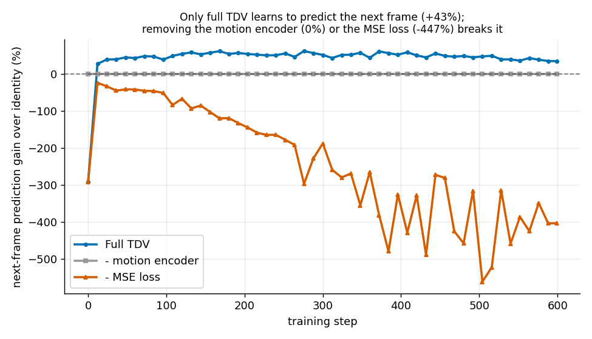
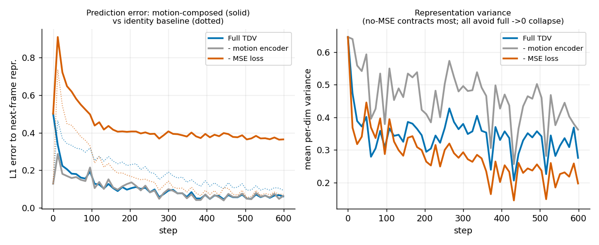

# Reproducing TDV's collapse ablation (Table 4)

**Paper:** *You Don't Need Strong Assumptions: Visual Representation Learning via Temporal Differences* (TDV) — [arXiv:2606.15956](https://arxiv.org/abs/2606.15956).
**Claim reproduced:** Table 4 — TDV's **motion encoder** and its **MSE next-frame-prediction loss** are each *critical*; removing either collapses training.
**Verdict:** ✅ **Reproduced (qualitatively)** on a downscaled synthetic proxy. The paper's ordering — *full recipe works; removing the motion encoder or the MSE loss breaks it* — reproduces cleanly and with a large margin. The exact ImageNet-KNN numbers are **not** reproducible on the available hardware and are **not** claimed.

---

## 1. The claim

TDV learns image representations from video with one weak assumption — *the past predicts the future*. A frame encoder maps a frame to `z_t`; a motion encoder maps the raw pixel change `Δx_t = x_{t+1} − x_t` to a latent shift `Δz_t`; training pushes the **additive composition** `ẑ_{t+1} = z_t + Δz_t` toward the (teacher-encoded) next frame `z_{t+1}`, via an MSE loss plus DINO/iBOT self-distillation (which prevents the trivial constant solution).

The paper's **Table 4** ablates each component and reports online **ImageNet KNN Top-5** as a collapse detector (collapsed representations → near-chance KNN):

| Ablation (ViT-S) | ImageNet KNN Top-5 ↑ | Avoids collapse |
|---|---:|:---:|
| **Full TDV recipe** | **17.05%** | ✅ |
| − Motion encoder | 1.87% | ❌ |
| − MSE loss | 1.58% | ❌ |

Removing either component drops KNN from ~17% to near random.

## 2. What we could and couldn't do locally

Full-scale reproduction (SSv2 pretraining at batch 256 for ~200k steps on multiple GPUs, then an online ImageNet-1k KNN probe) is far out of reach on the target hardware — a single **RTX 3050 Ti (4 GB)**. So this is a **downscaled, mechanism-level** reproduction, with an explicit substitution for the collapse detector.

**Collapse detector substitution.** With no ImageNet, we measure collapse with a **direct, unconfounded read on TDV's own objective**: the **next-frame prediction gain over the identity baseline**,

```
gain = ( ‖z_t − z_{t+1}‖  −  ‖ẑ_{t+1} − z_{t+1}‖ ) / ‖z_t − z_{t+1}‖
```

i.e. how much better the motion-composed prediction `ẑ_{t+1} = z_t + Δz_t` predicts the next frame than the trivial identity prediction `z_t`, in the same representation space (both are already logged as `l1_loss` and `baseline_l1_loss`). **Positive gain = the motion encoder is doing real work; zero/negative = it isn't.** We also track representation variance and DINO/iBOT teacher entropy as auxiliary collapse signals.

**Setup vs paper:**

| Aspect | Paper | This reproduction |
|---|---|---|
| Pretraining data | SSv2, ~220k real clips | Synthetic low-rank motion (textured disc on static bg), **32 train / 8 val** |
| Backbone | ViT-S/14 **and** ViT-B/14 | ViT-S/14 only, from scratch (`--load_without_weights`) |
| Batch size | 256 | **1** (×2 grad-accum) |
| Steps | ~200,000 (20 epochs) | **600** |
| Projection-head dim | 32,768 | 1,024 |
| Objective weights | λ_mse 1.5, λ_dino 1.5 | mse 1.5, dino 0.75 + ibot 0.75 (= 1.5) |
| Collapse detector | ImageNet KNN Top-5 | **prediction gain vs identity** + repr. variance/entropy |
| Compute | multi-GPU | 1× RTX 3050 Ti (4 GB), ≈7 min/arm |

## 3. Experimental lineage (why the data matters)

**Round 1 — `testsrc2` (negative control).** Our first synthetic clips used `ffmpeg testsrc2`, whose *whole frame* animates. This violates TDV's assumption that Δx is *low-rank* (a moving region over a mostly-static background). The consequence was diagnostic: consecutive frames were nearly identical, so the identity baseline was essentially unbeatable, the motion encoder had nothing to learn, and the collapse signal was confounded — representation variance came out **non-monotonic across arms** (frozen-high for no-motion, mid for full, low for no-MSE), an uninterpretable axis.

**Round 2 — faithful low-rank motion.** We replaced the data with a bright textured disc moving at a constant per-clip velocity over a static textured background (`data/cv/generate_synthetic_motion.py`); only ~10% of pixels change between the 0.25 s-apart sampled frames. With a real, learnable motion signal the clean separation below appears. *This lineage is itself a robustness check: the result is a property of TDV's mechanism meeting the right data, not an artifact of the metric.*

## 4. Result

600 steps, ViT-S/14, identical fixed command for every arm — differing only in the ablated component:

| Arm | Prediction gain over identity (end) | Repr. variance (end) | Outcome |
|---|---:|---:|:---|
| **Full TDV** | **+42.6%** | 0.31 | ✅ learns to predict motion; representations healthy |
| − Motion encoder | **0.0%** (exactly, every step) | 0.38 | ❌ `ẑ = z_t`; no temporal-difference signal to learn |
| − MSE loss | **−447%** | 0.23 (lowest) | ❌ unsupervised Δz corrupts the prediction; variance contracts |



The full model starts *worse* than identity (an untrained motion encoder adds noise) then overtakes it and stabilises around +45%. The motion-encoder-free arm is pinned at exactly 0% because its "prediction" *is* the identity baseline. The MSE-free arm sinks far below zero: the motion encoder still fires, but nothing supervises it, so its Δz is large unstructured noise.



Left: the motion-composed prediction error (solid) drops below the identity baseline (dotted) **only** for the full model. Right: representation variance — the no-MSE arm contracts the most (partial collapse); all three avoid a total variance→0 collapse because teacher-centering (present in every arm) blocks the textbook mode collapse at this scale.

**Interpretation.** This is the paper's collapse in its *functional* form — *representations that fail to support the task* — which is exactly what the paper's near-chance KNN measures. Both ablated components are shown necessary, matching Table 4.

## 5. Honest limitations

- Not the paper's benchmark: no ImageNet KNN, no SSv2, no ViT-B, no downstream flow/segmentation/depth decoders (Tables 2–3). We reproduce the *mechanism* (Table 4), not the headline numbers.
- Small sample: 32 train / 8 val synthetic clips; 600 steps; single seed per arm. Trajectories are step-noisy (batch size 1); we report medians over the last 15 steps.
- At this scale, no arm reaches a textbook `variance→0 / entropy→0` collapse; the collapse is functional (prediction), consistent with the paper's KNN-based definition.

**A full-scale reproduction would still require** real SSv2 pretraining (batch 256, ~200k steps, multi-GPU) + an online ImageNet-1k KNN probe to recover the exact 17.05 vs 1.87 / 1.58 numbers.

## 6. Provenance

All arms run the identical fixed command `bash job_scripts/pretrain_tdv_local_smoketest.sh` (local backend, RTX 3050 Ti) and differ only in committed code/config.

| Arm | Branch (runnable code + fixed config) | Change vs control |
|---|---|---|
| Full TDV control | [`experiment/full-tdv-control-faithful-low-rank-motion-data-r`](https://github.com/Razik-codes/tdv-collapse-ablation-reproduction/tree/experiment/full-tdv-control-faithful-low-rank-motion-data-r) | — |
| − Motion encoder | [`experiment/ablation-remove-motion-encoder-faithful-data-rou`](https://github.com/Razik-codes/tdv-collapse-ablation-reproduction/tree/experiment/ablation-remove-motion-encoder-faithful-data-rou) | `+ --remove_motion_encoder` |
| − MSE loss | [`experiment/ablation-remove-mse-loss-faithful-data-round-2`](https://github.com/Razik-codes/tdv-collapse-ablation-reproduction/tree/experiment/ablation-remove-mse-loss-faithful-data-round-2) | remove `--use_mse_loss` |

Supporting branches: the collapse-metric plumbing (`--log_var_covar`, opt-in `--print_metrics_to_stdout`, 600-step schedule) lives on the [round-1 control](https://github.com/Razik-codes/tdv-collapse-ablation-reproduction/tree/experiment/full-tdv-control-collapse-metrics-logged-table-4); the `testsrc2` round-1 arms document the negative-control lineage.

**Compute cost.** Round 2: 3 runs × ~7 min = ~21 min on one RTX 3050 Ti (4 GB); whole project (incl. round-1 arms) ≈ 1 GPU-hour. The tutorial's optional GPU lab (DINOv2 ViT-S Δz sweep) is a separate teaching demo, validated on CUDA (RTX 3050 Ti: 576-image sweep in 1.7 s, 419 MB peak).

*Reproduction driven through `experiment`; internal run IDs are recorded in the experiment tree (`experiment exp desc`), not here.*
